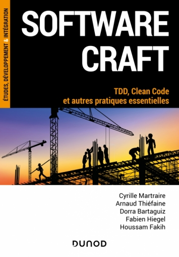

background-image: url(img/arolla-backgroud.jpg)
background-size: cover
class: center, middle

.bigtitle[Infra As Code et DEVOPS]

<div class="my-footer"><p><a href='https://github.com/vbauchart/presentation-infra-as-code'>https://github.com/vbauchart/presentation-infra-as-code</a></p></div>

---
layout: true
name: with-logo
<div class="my-header"></div>
<div class="my-footer"><p>&copy; 2023 Arolla</p></div>
---
layout: false
class: center, middle
template: with-logo

# Sondage rapide
---
template: with-logo

# Sondage rapide

## Qui utilise au quotidien :

### Git

--
### Docker

--
### Ansible

--
### Puppet

--
### Terraform

--
### Kubernetes


[//]: ################################
---
layout: false
template: with-logo

# Vincent Bauchart

## Parcours

### Consultant Devops pour BV Associates (11 ans)

### Manager équipe CI/CT/CD pour Ingenico (5 ans)

### Consultant Devops Senior pour Arolla depuis 2023

## Compétences

### Linux

### Puppet, Ansible, Docker

### Python, Go

### AWS (Amazon Web Services)

### Management

### Sécurité

.right[https://fr.linkedin.com/in/vincent-bauchart-4a184560]


[//]: ################################
---
layout: true
template: with-logo

# Arolla

---

## ESN spécialisé dans le Craft

### Développement, Architecture, Devops

### Organisation de meetups (Paris)

## Le Craft : pratiques de développement au service

### TDD (Test Driven Development)

### BDD (Behavior Driven Development)

### DDD (Domain Driven Design)

### Clean Code (KISS, DRY, YAGNI, SOLID, ...)

### Clean Architecture


[//]: ################################

---
### https://www.dunod.com/sciences-techniques/software-craft-tdd-clean-code-et-autres-pratiques-essentielles

.fit[
  .center[]
]


[//]: ################################
[//]: ################################

---
layout: false
template: with-logo

# Sommaire

## 1. La problématique du déploiement d'infrastructure

## 2. Les outils d'Infrastructure As Code

## 3. Everything As Code

# Objectifs

## Démystifier quelques outils d'Infrastructure As Code

## Comprendre les nouveaux enjeux d'organisations et de responsabilité

???


[//]: ################################
[//]: ################################
---
layout: false
class: center, middle
template: with-logo


# Problématique 

## La vie d'un administrateur système

[//]: ################################
---
layout: true
template: with-logo

# La vie d'un administrateur système

[//]: ################################
---

## On vous appelle en urgence, il faut mettre à jour la configuration SSH sur les 2000 serveurs du parc.

--
### Je me connecte à tous les serveurs un par un ? 🤦


--
### Je me rend compte qu'un collègue a changé le mot de passe admin de certains serveurs 🥲

[//]: ################################
---
## Les équipes de tests me demandent de créer un environnement identique à la production pour tester de bout en bout.

--
### Je me connecter à VMWare pour créer les 16 serveurs 👨‍🔧

--
### J'installe Redhat sur chaque serveur et je configure les packages de base (SSH, users) 🌡️

--
### Je retrouve tout ce qui est installé en production 🤔

--
### Je dois installer des bases de données, des middlewares, des applicatifs 😰

--
### Je demande de l'aide aux développeurs 🥺

[//]: ################################
---
## Mon site est victime de son succès, il faut passer de 2 à 10 serveurs frontaux !

--
### Je fais une demande pour 8 nouvelles VMs. 👋

--
### J'attend la livraison des VMs par l'équipe système. 🕑

--
### J'installe et configure les 8 VMs 💀

--
### Je fais une demande à l'équipe réseau pour ouvrir les ports 🤨

--
### Je ne trouve pas la documentation, je cherche le collègue qui a fait la première installation. 🏃

--
### Une fois terminé le site renvoie une erreur une fois sur 10 😰

--
### C'est la panique, je passe la nuit à trouver la virgule en trop qui faisait tout planter 😑

--
### 3 mois plus tard, je me rend compte que j'ai oublié de monitorer les 8 nouvelles machines et une des VM a un problème depuis des semaines et personne ne l'a remarqué 🙃


[//]: ################################
---
layout: false
class: center, middle
template: with-logo

# Premières pistes


[//]: ################################
---
layout: false
template: with-logo

# La cible 🎯

## Ne plus faire à la main les tâches répétitives

## Augmenter l'autonomie des équipes

## Ne pas dépendre d'une documentation périmée

## ➡️ Anticiper les problèmes

## ➡️ Améliorer la confiance

## ➡️ Augmenter la vitesse

[//]: ################################
---
layout: false
template: with-logo

# La méthode ⚙️

## La solution tiens en 3 mots :
--

### Automatiser
--

### Automatiser
--

### Automatiser

.right[]


[//]: ################################
[//]: ################################
---
layout: false
class: center, middle
template: with-logo

# Automatisation ?

[//]: ################################
---
layout: true
template: with-logo

# Automatisation ?

[//]: ################################
---

## `Fournir` des ressources au travers d'API

### Machines virtuelles

### Bases de données

### Ouvertures réseaux

## `Coder` l'installations et la configuration des systèmes

### OS

### Configuration système

### Déploiement applicatif

[//]: ################################
---
## 🤖 Utiliser les outils des développeurs

### Choisir des langages et des frameworks adaptés à nos besoins

### Utiliser des outils d'aide au développement (IDE, IA, linters, etc...)

### Utiliser des méthodes connues comme le Craft

## 🎠Tester

### Vérifier que le résultat de l'automatisation est conforme au résultat attendu

### Vérifier les situations spécifiques et cas limites

## 🚩 Versionner

### Sauvegarder l'avancement

### Expérimenter dans des branches de code

### Identifier quel base de code est déployée

[//]: ################################
---
## Mon site est victime de son succès, il faut passer de 2 à 10 serveurs Web

--
## Dans le monde "idéal":

### Modification du code de l'infrastructure :
```sh
$ git checkout develop                   # branche principale de dev
$ git checkout -b upgrade-servers        # créer branche de test
*$ vim application/web/servers.yml        # modifie la config
$ git commit -am'upgrade to 10 servers'  # ajoute message pertinent
$ git push                               # la CI/CD prend le relais
```

### Suivre le déploiement dans l'environnement de test ☕

### Tester

### Recommencer

---
## Mon site est victime de son succès, il faut passer de 2 à 10 serveurs Web

## Dans le monde "idéal":

### Mise en production :

```sh
$ git checkout master                    # branche de release
*$ git merge upgrade-servers              # merge la branche
$ git push                               # la CI/CD prend le relais
```

### Suivre le déploiement dans l'application de monitoring ☕

--
.image-flash[]

[//]: ################################
---
## État de l'art de l'Infrastructure As Code

## 1. Les gestionnaires de configuration

### Puppet

### Ansible


## 2. Les provisionneurs

### Terraform

### *Ansible*

## 3. Les orchestrateurs

### Kubernetes/Docker


[//]: ################################
[//]: ################################
---
layout: false
class: center, middle
template: with-logo

# Les gestionnaires de configuration


[//]: ################################
---
layout: true
template: with-logo

# Les gestionnaires de configuration
---

## S'execute sur une machine en _fonctionnement_

### Installe des packages

### Créer des users/groups/répertoires

### Créer des fichiers de configuration

### Lance des commandes de configuration

### Upload des fichiers

### Redémarre des services


[//]: ################################

---

## Exemple installation d'un site web sur Debian :

### Installe le paquet `apt install nginx`

### Adapter le fichier `/etc/nginx/conf.d/default.conf` à nos besoins

### Ajouter un utilisateur `appuser01`

### Redémarrer le service `nginx`

--
## 👉 Un script shell semble pouvoir faire l'affaire !! 👈


[//]: ################################
---

## Un script shell par produit

## Problème résolu 😎

```bash
#!/bin/bash -e

apt install -y nginx

sed 's/^listen 80 /^listen 8080 /' /etc/nginx/conf.d/default.conf

useradd -m app01

systemctl restart nginx
```

--
.image-flash[]


[//]: ################################
---

## Problèmes à gérer :

### Comment gérer un parc hétérogène (Debian, Redhat, ...) ?

### Comment gérer l'installation **et/ou** la mise à jour ?

### Que se passe-t-il si le serveur n'est pas dans l'état prévu ?

### Comment savoir quels logiciels installer selon le role de la machine ?

### Comment permettre d'avoir plusieurs instances de l'application avec des paramètres différents ?


[//]: ################################
---

## *Petite pause vocabulaire !*

## Idempotence en mathématique

### une fonction a le résultat qu'on l'applique une ou plusieurs fois

### Par exemple, la fonction `abs()` est idempotente :

```
abs(abs(x)) = abs(x)
```

```
abs(-5) = 5
asb(abs(abs(-5))) = 5
```

[//]: ################################
---

## Idempotence pour de la configuration :

### Une opération produit le bon résultat peu importe l'état initial d'une ressource

--
```bash
# Indempotent
apt install -y nginx
```

--
```bash
# PAS indempotent
useradd -m app01
```

--
```bash
# PAS indempotent
echo "listen 80" >> /etc/nginx/conf.d/default.conf
```

--
```bash
# Indempotent (si le fichier n'a pas été modifé par ailleurs)
sed 's/^listen 80 /^listen 8080 /' /etc/nginx/conf.d/default.conf
```

[//]: ################################
---

## Pourquoi la notion d'`idempotence` est importante pour un gestionnaire de configuration ?

### On veut gérer la mise à jour d'un parc de serveurs quelque soit leur état initial

### On veut gérer le cas d'une mise à jour arrêtée brusquement

### La mise à jour ne doit pas être sensible à une intervention manuelle

### Si la ressource est déjà bien configurée, on ne fait rien


[//]: ################################
---

## Problèmes à gérer (v2.0) :

### Comment gérer un parc hétérogène (Debian, Redhat, ...) ?

### .grey[~~Comment gérer l'installation **et/ou** la mise à jour~~]

### .grey[~~Que se passe-t-il si le serveur n'est pas dans l'état prévu ?~~]

### .red[Comment assurer l’idempotence de chaque déploiement]

### Comment savoir quels logiciels installer selon le role de la machine ?

### Comment permettre d'avoir plusieurs instances de l'application avec des paramètres differents ?


[//]: ################################
---

## Principales fonctionnalités attendues :

### .red[Classifier] les serveurs : leur donner un ou plusieurs rôles

### Créer des .red[ressources systèmes] de manière .red[idempotente] (fichiers, repertoires, user, groups, configuration réseau, etc...)

### Créer des fichiers de configuration à partir de .red[templates] à remplir

### Être .red[extensible] par programmation pour s'adapter aux besoins spécifiques


[//]: ################################
---

## Les gestionnaires de configuration traditionnels :

### **Ansible**

### **Puppet**

### .grey[Chef]

### .grey[Salt]

### .grey[...]

### .grey[👉 https://en.wikipedia.org/wiki/Comparison_of_open-source_configuration_management_software]

## Un gestionnaire de configuration un peu spécial :

### Docker

[//]: ################################
[//]: ################################
---
layout: false
class: center, middle
template: with-logo

# Ansible

[//]: ################################
---
layout: true
template: with-logo

# Ansible

[//]: ################################
---

## Mode d'installation du contrôleur (`Control Node`)

### Le framework Ansible

### La clef privée SSH

### Les fichiers de description clonés depuis GIT

## Mode d'installation des serveurs supervisés (`Managed Nodes`)

### Python (dans une version [suffisamment récente](https://docs.ansible.com/ansible/latest/installation_guide/intro_installation.html#node-requirement-summary))

### Un utilisateur possédant la clef publique SSH

### Cet utilisateur doit avoir suffisamment de droit sur le système (ex: `sudo`)

> On notera le peu de prérequis nécessaires, en particulier sur les serveurs supervisés

[//]: ################################
---

## Vocabulaire

### On décrit les groupes de `nodes` dans un `inventory`

### On execute un `playbook` sur un un groupe de `nodes`

### Un `playbook` est un fichier .red[YAML] constitué d'une liste de `tasks`

### Une `task` upload et execute un `module` sur chacun des `nodes`

### Un `module` est un morceau de code (généralement .red[Python]) qui s'execute sur le `node`

### Il est possible de regrouper des `tasks` dans un `role`

### Un language de `templates` (Jinja2) est fourni pour créer des fichiers de configuration

???
Inventory statique ou dynamique

[//]: ################################
---

## Pour chaque `playbook`

### Le `playbook` est exécuté localement sur le contrôleur

### Chaque `playbook` vise un groupe de `nodes` 

### Chaque `task` est exécutée l'une après l'autre dans l'ordre

## Pour chaque `task`

### Le code du `module` est uploadé par SSH sur chaque `node` du groupe

### Le `module` est exécuté avec ses paramètres et retourne le résultat à la `task`

### On peut stocker le résultat du `module` dans une variable

### On peut utiliser les variables dans les `tasks` suivantes

[//]: ################################
---

## `modules` essentiels (indempotents) :

### file

### user

### package

### service

### template

### .grey[command] (.red[peut casser l'idempotence!!])

### ...

https://docs.ansible.com/ansible/latest/collections/index_module.html

## + vos propres modules

[//]: ################################
---

## Exemple de `task` :

```YAML
- name: 'Template a file to /etc/file.conf'
  ansible.builtin.template:
    src: 'motd.j2'
    dest: '/etc/motd'
  vars:
    server_role: 'database'
    environment: 'prod'
```

## Contenu de `./templates/motd.j2` :

```Django
Welcome on {{ server_role }}


You are on a PRODUCTION server, be careful and don't break anything !

You are on {{ environment }} server.

```

[//]: ################################
---

## Avantages 👍

### Installation simple sur les `nodes` : Python et un serveur SSH

### Langage de description YAML très simple

### Facilité d'ajout de ses propres modules Python (ou autre langage)

## Inconvénients

### YAML montre ses limites en cas de scénarios complexes

### Ressemble à un langage de programmation sans en être un

### Aucune sécurité par défaut

### Pas de serveur central par défaut

### Attention au passage à l'échelle !

???
- C'est possible que la clef SSH privée soit distribuée à tout le monde, donnant accès à toutes les machines en root !!
- Tentation d'utiliser le module `shell` qui casse tout l'interêt de Ansible
- Il est cependant possible de faire propre avec Ansible avec des règles strictes

[//]: ################################
---
layout: false
template: with-logo

# DEMO

https://github.com/vbauchart/presentation-infra-as-code-ansible-demo

[//]: ################################
---
layout: false
class: center, middle
template: with-logo

# Puppet

[//]: ################################
---
layout: true
template: with-logo

# Puppet

[//]: ################################
---

## Mode d'installation du contrôleur

### Le service `puppet master`

### Les fichiers de description clonés depuis GIT

> 📣 L'installation d'une infrastructure Puppet peut être **complexe**.

## Mode d'installation des serveurs supervisés ()

### Un `puppet agent` enregistré auprès d'un `puppet master`

> 📣 L'installation d'un serveur supervisé nécessite que l'agent Puppet soit **déjà** installé. Puppet doit donc être inclus à l'installation par un autre moyen.


[//]: ################################
---

## Vocabulaire

### On décrit les groupes de `nodes` dans un `inventory`

### On execute un `module` sur un un groupe de `nodes`

### Un `manifest` est un fichier .red[.pp] écrit en Puppet (le _DSL_)

### Une `ressource` est la brique de base permettant la modification du système

### Les `ressources` sont regroupées en `class` ou en `defined resources` qui peuvent prendre des paramètres

### Un language de `templates` (ERB) est fourni pour créer des fichiers de configuration


[//]: ################################
---

## Le Langage Puppet

### Comme le YAML de Ansible, il .red[décrit] l'état du système

### Beaucoup plus expressif que YAML, il se rapproche d'un vrai langage de programmation

## Programmation dans Puppet

### Boucles

### Structure conditionnelles

### Variables typées avec une portée de block

### Fonctions (`defined ressources`)

[//]: ################################
---

## `ressources` essentielles (idempotentes) :

### file (avec template)

### user

### package

### service

### .grey[exec] (.red[peut casser l'idempotence!!])

### ...

https://www.puppet.com/docs/puppet/7/type.html

[//]: ################################
---

## Exemple de `ressources`

```Puppet
$server_role = 'database'
$environment = 'prod'

file {
  '/etc/motd':
    content => template('nginx/motd.erb'),
    mode    => '0644',
    owner   => root,
}
```
## Contenu de `./nginx/templates/motd.erb` :

```ERB
Welcome on <%= @server_role %>

<% if @environment == 'prod' %>
You are on a PRODUCTION server, be careful and don't break anything !
<% else %>
You are on <%= @environment %> server.
<% end %>
```

[//]: ################################
---

## Pour chaque `node`

### Le `puppet agent` envoie une requête de mise à jour `puppet master`

### Le `puppet master` .red[compile] tous les fichiers `.pp` associés au `node`

### Le `puppet master` produit un fichier `catalog` contenant une liste de ressources à installer

### Le `puppet agent` reçoit le `catalog` et applique les modifications nécessaires


???
régulierement = toutes les 1/2/3 heures ?

[//]: ################################
---

## Avantages 👍

### Langage proche d'un language de programmation

### Language plus expressif limitant le besoin de créer des ressources sur-mesures

### Chaque node requête le master à intervalle régulier

## Inconvénients

### Plus difficile à administrer que Ansible

### Pas d'orchestration multi-nodes, chaque node est autonome

### Problème de scalabilité à cause du serveur central

[//]: ################################
---
layout: false
template: with-logo

# DEMO

https://github.com/vbauchart/presentation-infra-as-code-puppet-demo

[//]: ################################
---
layout: false
template: with-logo

# Ansible VS Puppet


.center[<div class="mermaid">
  flowchart TD

  subgraph Ansible
  Playbook([Playbook]) --ssh--> Node1
  Playbook([Playbook]) --ssh-->  Node2
  Playbook([Playbook]) --ssh-->  Node3
  Playbook([Playbook]) --ssh-->  Node4
  end
</div>]

.center[<div class="mermaid">
  flowchart BT
  
  subgraph Puppet
  Agent1 --request--> Master([Master])
  Agent2 --request--> Master([Master])
  Agent3 --request--> Master([Master])
  Agent4 --request--> Master([Master])
  end

</div>]


[//]: ################################
[//]: ################################
---
layout: false
class: center, middle
template: with-logo

# Docker

[//]: ################################
---
layout: true
template: with-logo

# Qu'est-ce que Docker ?

[//]: ################################
---

## Docker est un système d'isolation de processus utilisant la technologie de `namespace` du noyau Linux

## Un processus dans `namespace` ne peux pas voir les processus d'un autre `namespace`

## Un processus dans `namespace` n'a pas accès aux utilisateurs, aux fichiers, au réseau d'un autre `namespace`

## Alternative légère à la virtualisation 🤩

## Le nom d'un processus dans un `namespace` est un `container`

???
Je simplifie à mort

[//]: ################################
---

.fit[]


[//]: ################################
---

## Quel est le rapport avec l'Infra As Code ?

## Docker est livré avec un gestionnaire de création d'`image` de disque

### Un mini-langage qui décrit la construction de l'image : `Dockerfile`

### Un système d'héritage d'images pour en créer des nouvelles

### Un système en "couches" (`layers`) qui permet une grande optimisation du stockage et du transfert des images

### Un protocole de `registry` qui permet de stocker des images sur un serveur central


[//]: ################################
---

## Une fois l'`image` Docker généré, elle ne sera plus modifiée et sera distribuée tel quel sur les serveurs d'execution

## Au moment de l'execution:

### Docker peut passer des variables d'environnement au `container`

### Docker peut montrer un "vrai" répertoire dans le `container`

### Docker peut rediriger un "vrai" port vers un `container`

[//]: ################################
---
layout: false
template: with-logo

# DEMO

https://github.com/vbauchart/presentation-infra-as-code-k8s-demo


[//]: ################################
---
layout: true
template: with-logo

# Docker est-il un gestionnaire de configuration ?

## Plus besoin d'installer des serveurs, il suffit de récupérer l'`image`

## Chaque serveur n'a besoin que d'un démon Docker et rien d'autre

## On peut lancer plusieurs `containers` sans crainte de conflit

[//]: ################################
---

## Plus besoin de gestionnaire de configuration


[//]: ################################
[//]: ################################
---
layout: false
class: center, middle
template: with-logo

# Kubernetes

[//]: ################################
---
layout: true
template: with-logo

# Kubernetes

---

## OK, Docker est cool 😎, mais :

### Une fois qu'on a toutes nos `images`, qui les exécute ?

### Comment faire pour que les `containers` se parlent entre eux ?

### Et s'ils sont démarrés sur des machines différentes ?

### Quand un serveur attend ses limites, il faut créer autre serveur pour lancer les `containers` suivants ?

## Comment gérer des containers à l'échelle d'un SI ? 🏗️

[//]: ################################
---


## Décrire des groupes d'images Docker (`Pod`)

## Créer plusieurs instance (`replicat`) d'un même `pod`

## Répartir les requêtes entre les instances de `pod` (`Ingress`)

## Créer des réseaux virtuels associés aux `pods`

## Mettre à jour les `pods` avec les nouvelles images et relancer les `pods` défectueux

## Utiliser des configuration .red[YAML] pour stocker toutes ces informations

[//]: ################################
---

## DEMO 

https://github.com/vbauchart/presentation-infra-as-code-k8s-demo

[//]: ################################
---

## Avantages 👍

### Séparation complète architecture hardware/software

### Homogéniété de deploiement applicatif

### Ajout de puissance globale par simple ajout d'un node (scalabilité)

### Des tonnes de plugins

## Inconvénients 💩

### Déplacement de la complexité sur l'administration de Kubernetes (Sécurité, mise à jour, ...)

### Devenu standard de-facto, au détriment des autres solutions

### Les `pods` sont volatiles, alors que les données statiques

???
Kubernetes As a Service
Autres solutions: AWS ECS, Nomad


[//]: ################################
[//]: ################################
---
layout: false
class: center, middle
template: with-logo

# Terraform

[//]: ################################
---
layout: true
template: with-logo

# Terraform

---

## Famille des provisionners

## Créé pour gérer la création des ressources Cloud
### Amazon Web Services

### Google Cloud Platform

### Microsoft Azure

### VMWare

### OpenStack

### ...

## Plus globablement, c'est un outil spécialisé pour gérer des ressources externes créé par API HTTP CRUD :

### Active Directory

### Jira/Confluence

### Gitlab

### ...


[//]: ################################
---
## A chaque lancement, Terraform va lire le contenu des fichiers de description (format .red[HCL])

## Si la ressource distante n'existe pas:

### Créer la ressource distante (`POST /ressource/create`)

### Stocke l'identifiant de la ressource localement (fichier `state`)

## Si la ressource distante existe déjà

### Recupère l'identifiant localement (fichier `state`)

### Vérifie l'état de la ressource distante (`GET /ressource/id`)

### Met à jour si les paramètres different (`POST /ressource/id/update`)


[//]: ################################
---
layout: false
template: with-logo

# DEMO

https://github.com/vbauchart/aws-terraform-ansible-demo

[//]: ################################
---
layout: true
template: with-logo

# Remise en perspective

---

## 1. Les gestionnaires de configuration

### Puppet, Ansible

### *Docker* : .grey[Usage permetant d'arriver au même résultat qu'un gestionnaire de configuration]

## 2. Les provisionneurs

### Terraform

### *Ansible* : .grey[possède des modules indempotents pour interagir avec des API HTTP CRUD, et non-HTTP comme des switch, des routeurs...]

## 3. Les orchestrateurs

### Kubernetes

### *Ansible* : .grey[Le module `shell` permet de lancer des tâches parallèle sur une ferme de calcul]

[//]: ################################
---

## Certains outils peuvent être adaptés aux besoins de l'entreprise.

## Il est souvent nécéssaire d'utiliser plusieurs outils pour couvrir tous les besoins, par exemple :

### Ansible + Kubernetes

### Puppet + Docker

### Terraform + Ansible

## Les fournisseurs Clouds fournissent également leurs propres solutions, par exemple :

### AWS fournit un système "maison" pour construire des images de VM (`AMI`) et les lancer automatiquement (`Autoscaling Groups`)

### GCP peut gérer un serveur Kubernetes sur lequel on peut "brancher" ses propres serveurs

???
AWS ECS alternative à K8S
Heroku, Clever CLoud

[//]: ################################
---
layout: true
template: with-log

# Premières Conclusions

---

## Tous ces outils permettent de décrire dans du .red[code] toutes les étapes du cycle de vie d'une application :

### l'infrastructure réseau, système

### la configuration des applications

### le déploiement des applications

## Mais aussi:

### Le déploiement du monitoring

### Les procédures d'exploitation


[//]: ################################
[//]: ################################
---
layout: false
class: center, middle
template: with-logo

# Everything As Code

???
La chasse est ouverte, la chasse aux actions manuelles !!

[//]: ################################
---
layout: true
template: with-logo

# Everything As Code

---


## Ces outils ont totalement changé la façon d'administrer un parc de machines

## Il est possible de gérer ce code un "vrai" developpeur

### Utilisation d'IDE évolués offrant l'autocomplétion et la vérification de syntaxe comme `Visual Code`

### Versionning `GIT`, gestion de branches et tags

## Qualité logicielle, Clean Code

### Keep It Stupid Simple (KISS)

### Don't Repead Yourself (DRY)

### You Ain't Gonna Need It (YAGNI)

### Single Responsibility Principle (SRP)

### 

???
Renvoyer au livre Software Craft


[//]: ################################
---

## Tests unitaires

### Test d'un `role` Ansible

### Test d'une `class` Puppet

## Continous Intégration

### Chaque fois que le code est modifié, tous les tests sont lancés

## Tester en "réel"

### Création d'environnements éphémères sur des branches

### Tests End-To-End


[//]: ################################
---

## Le mouvement `Infrastructure As Code` s'étend progressivement à toutes étapes de conception logiciel

## IDE As Code

### Devcontainer

### Gitpod

## CI/CD As Code

### Gitlab CI

### Github Actions

### Jenkinsfile

## Network As Code

### [Ansible for Cisco](https://docs.ansible.com/ansible/latest/collections/cisco/index.html)

???
Chasse aux actions manuelles
Cette présentation est faite en Markdown

[//]: ################################
---

## Presentation As Code

### Remark

### Revealjs

## Diagram As Code

### Mermaid

## CV As Code

### Jsonresume

### https://gitlab.com/vbauchart/resume


[//]: ################################
---

## Ces méthodes ont un impact sur le métier d'administrateur système, avec des nouveaux modèles d'organisation :

## DEVOPS

### Rapprochement des metiers de developpeurs et d'administrateur système

## Site Reliability Engineers (SRE)

### Culture de l'automatisation

### Travaille main dans la main avec les developpeurs 

## Team Topology (Platform Teams)

### Les équipes de developpements sont résponsable de toute la chaine

### Les Platform Teams fourni une "interface" pour interagir avec l'infrastructure

???

[//]: ################################
[//]: ################################
---
layout: false
class: center, middle
template: with-logo

# Questions

[//]: ################################
[//]: ################################
---
layout: false
background-image: url(img/arolla-backgroud.jpg)
background-size: cover
class: center, middle


